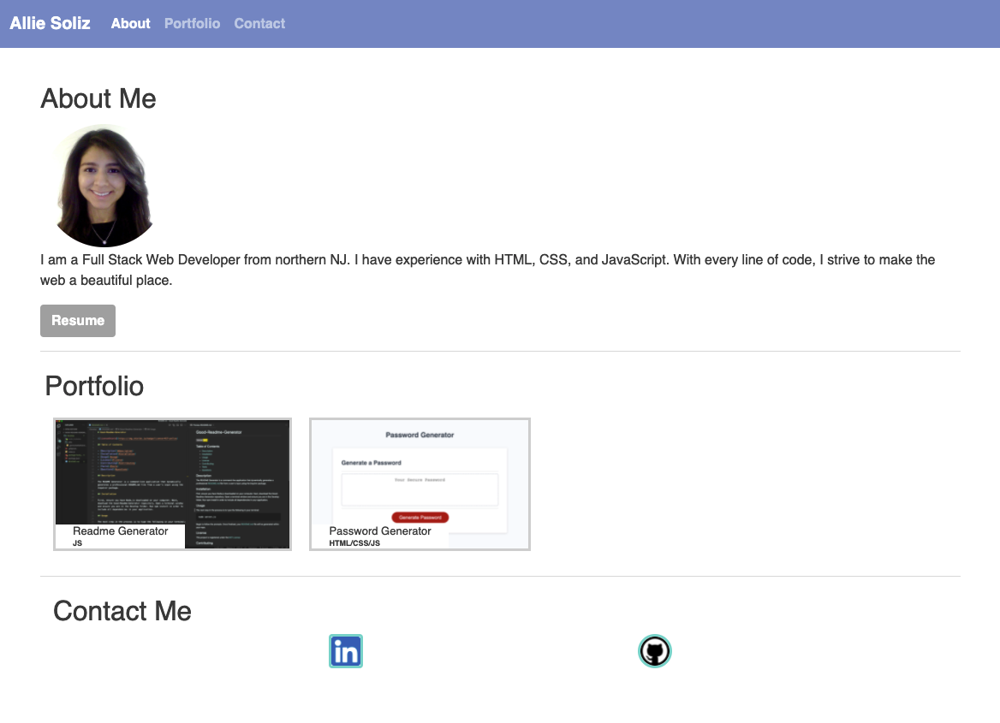

# My-Portfolio-V2# My-Portfolio
Introduction: Allie Soliz

My Portfolio repo is a web page that contains an introduction of myself in the 'About Me' section. 

My Portfolio repo also contains links to my projects on GitHub in the 'Portfolio' section. 

My Portfolio repo also contains a link to a pdf version of my resume in the About Me Section,'Resume' button. This opens a new tab to my resume.

My Portfolio repo also contains a link to my LinkedIn and GitHub pages.

Link for deployed webpage of My-Portfolio
https://azs6189.github.io/My-Portfolio/

Screenshot deployed webpage for My-Portfolio

